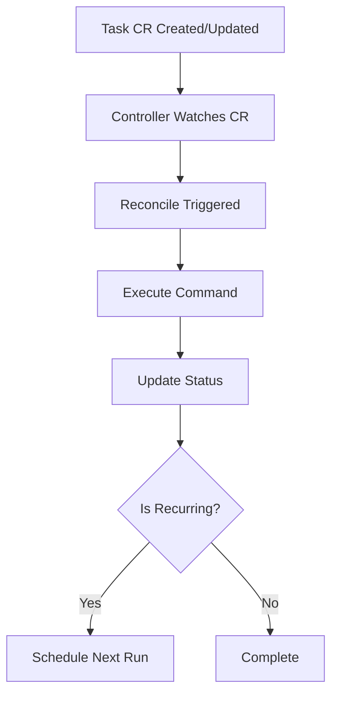

# Kubernetes Custom Controller for Task Management

A custom Kubernetes controller that manages `Task` custom resources, allowing users to define and execute commands within the cluster.

## Overview

This project implements a Kubernetes custom controller that watches for `Task` custom resources. When a `Task` is created or updated, the controller executes the specified command and updates the resource's status with the execution results.

### Features

- Execute shell commands defined in Kubernetes custom resources
- Support for one-time and scheduled tasks (using cron expressions)
- Track execution history and status
- Simple CRD-based API
- Built with [Kubebuilder](https://book.kubebuilder.io/) and the [controller-runtime](https://github.com/kubernetes-sigs/controller-runtime) library

## Architecture

The controller follows the standard Kubernetes controller pattern:

1. Watches for changes to `Task` resources
2. For each change, enqueues the resource for processing
3. Processes each resource by executing the specified command
4. Updates the resource status with execution results
5. For recurring tasks, schedules the next execution



## Getting Started

### Prerequisites

- Go 1.24.0+
- Docker 20.10.0+
- kubectl 1.26.0+
- Kubernetes cluster (v1.26.0+ recommended)
- [kubebuilder](https://book.kubebuilder.io/quick-start.html#installation) (for development)
- [kind](https://kind.sigs.k8s.io/) (for local testing)
- [kustomize](https://kubectl.docs.kubernetes.io/installation/kustomize/)

## Installation

### Local Development Setup

1. **Create a local Kubernetes cluster with Kind:**

   ```bash
   kind create cluster --name task-controller-test
   ```

2. **Install the CRDs:**

   ```bash
   make install
   ```

3. **Run the controller locally:**

   ```bash
   make run
   ```

### Deploying to a Cluster

1. **Build and push the controller image:**

   ```bash
   # Set your Docker username
   export DOCKER_USER=your-username
   
   # Build and push the image
   make docker-build docker-push IMG=ghcr.io/$DOCKER_USER/k8s-controller:latest
   ```

2. **Deploy the controller to your cluster:**

   ```bash
   make deploy IMG=ghcr.io/$DOCKER_USER/k8s-controller:latest
   ```

3. **Verify the installation:**

   ```bash
   kubectl get pods -n k8s-controller-system
   ```

## Usage

### Creating Tasks

Create a `Task` resource to execute a command:

```yaml
# config/samples/task_v1_echo.yaml
apiVersion: task.task.sysd.io/v1
kind: Task
metadata:
  name: echo-task
spec:
  command: echo
  args: ["Hello, Kubernetes!"]
```

Apply the task:

```bash
kubectl apply -f config/samples/task_v1_echo.yaml
```

### Scheduling Recurring Tasks

Create a recurring task using a cron expression:

```yaml
# config/samples/task_v1_cron.yaml
apiVersion: task.task.sysd.io/v1
kind: Task
metadata:
  name: cron-task
spec:
  command: date
  args: ["+%Y-%m-%d %H:%M:%S"]
  schedule: "*/1 * * * *"  # Run every minute
```

### Checking Task Status

View all tasks:

```bash
kubectl get tasks
```

Get detailed information about a task:

```bash
kubectl describe task <task-name>
```

View task logs:

```bash
kubectl logs -n k8s-controller-system -l control-plane=controller-manager
```

## Uninstallation

### Remove All Tasks

```bash
kubectl delete tasks --all
```

### Uninstall the Controller

```bash
make undeploy
```

### Remove CRDs

```bash
make uninstall
```

## Development Guide

### Development Prerequisites

- Go 1.24.0+
- Docker 20.10.0+
- kubectl
- kind
- kubebuilder

### Building the Project

```bash
# Generate code
make generate

# Build the controller
make build

# Build the Docker image
make docker-build IMG=controller:latest
```

### Running Tests

```bash
# Run unit tests
make test

# Run e2e tests
make test-e2e
```

### Code Generation

After modifying API types, run:

```bash
make generate
make manifests
```

## Troubleshooting

### Common Issues

1. **CRD not found**
   - Ensure you've run `make install`
   - Check that the CRD is installed: `kubectl get crd tasks.task.task.sysd.io`

2. **Controller not starting**
   - Check logs: `kubectl logs -n k8s-controller-system -l control-plane=controller-manager`
   - Verify RBAC permissions

3. **Tasks not being processed**
   - Check controller logs for errors
   - Verify the controller is running: `kubectl get pods -n k8s-controller-system`

## Advanced Topics

### Metrics and Monitoring

The controller exposes Prometheus metrics at `/metrics` on the metrics port (default: 8080).

#### Setting Up Monitoring

To monitor your tasks:

1. Install the Prometheus Operator:

   ```bash
   kubectl apply -f https://raw.githubusercontent.com/prometheus-operator/prometheus-operator/v0.52.0/bundle.yaml
   ```

2. Deploy a Prometheus instance to scrape the controller metrics.

### Security Considerations

- The controller runs with minimal RBAC permissions
- Commands run with the same permissions as the controller pod
- Consider using a dedicated service account with appropriate security contexts

For more information about using and extending this controller, please refer to the [Kubebuilder Documentation](https://book.kubebuilder.io/introduction.html).

You can also run `make help` to see all available Makefile targets for building, testing, and deploying the controller.

## Software License

```text
Copyright 2025.

Licensed under the Apache License, Version 2.0 (the "License");
you may not use this file except in compliance with the License.
You may obtain a copy of the License at

    http://www.apache.org/licenses/LICENSE-2.0

Unless required by applicable law or agreed to in writing, software
distributed under the License is distributed on an "AS IS" BASIS,
WITHOUT WARRANTIES OR CONDITIONS OF ANY KIND, either express or implied.
See the License for the specific language governing permissions and
limitations under the License.
```
