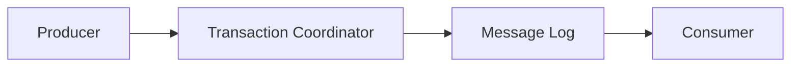

# Kafka Transactional Messaging

A simplified implementation of Kafka's transactional messaging system in Go. This exercise demonstrates the core concepts of distributed transactions in a message streaming system.

## Overview

This project implements a simplified version of Kafka's transactional messaging system, focusing on:

- **Atomic Transactions**: Messages are either all committed or all aborted
- **Transaction Coordinator**: Manages the transaction lifecycle
- **Transactional Producer**: Sends messages within transactions
- **Transactional Consumer**: Reads only committed messages in order
- **In-Memory Message Log**: Stores messages with transaction metadata

## Architecture



## Components

### Transaction Coordinator

- Manages transaction states (BEGIN, PREPARE, COMMIT, ABORT)
- Tracks in-flight transactions
- Handles timeouts and recovery

### Transactional Producer

- Begins/commits/aborts transactions
- Associates messages with transactions
- Handles retries and error cases

### Message Log

- Stores messages with transaction metadata
- Maintains message ordering within partitions
- Handles transaction markers (BEGIN, PREPARE, COMMIT, ABORT)

### Transactional Consumer

- Filters messages based on transaction state
- Maintains read position
- Handles transaction boundaries

## Getting Started

### Prerequisites

- Go 1.16 or later

### Building and Running

1. Start the transaction coordinator:

   ```bash
   cd cmd/coordinator
   go run main.go
   ```

2. Start the message log:

   ```bash
   cd cmd/message-log
   go run main.go
   ```

3. Run the producer example:

   ```bash
   cd cmd/producer
   go run main.go
   ```

4. Run the consumer example:

   ```bash
   cd cmd/consumer
   go run main.go
   ```

## Testing

Run the test suite:

```bash
go test ./...
```

## Implementation Notes

- This is a simplified implementation for educational purposes
- The message log is in-memory and not persistent
- Error handling and edge cases are simplified
- Focus is on demonstrating core concepts rather than production readiness

## Next Steps

- Add persistence for the message log
- Implement proper error handling and recovery
- Add support for multiple partitions
- Implement consumer groups and offset management
