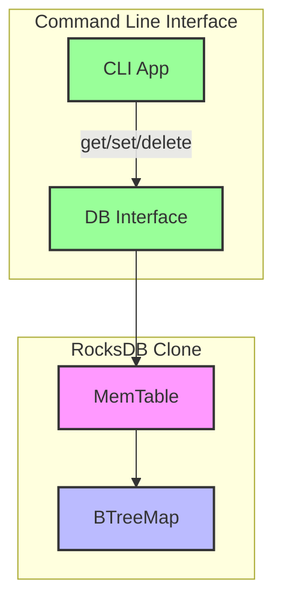

# RocksDB Clone

A learning-focused implementation of a RocksDB-like key-value store in Rust.

## Overview

This project is an educational implementation of a key-value store inspired by RocksDB. It's designed to help understand the internals of LSM-tree based storage engines.

## Features

- [x] In-memory MemTable with get/put/delete operations
- [ ] Write-ahead log (WAL) for durability
- [ ] SSTable storage format
- [ ] Compaction strategies
- [ ] MVCC (Multi-Version Concurrency Control)
- [ ] Column families
- [ ] Merge operators

## Current Architecture



### Components

- **CLI App**: Command-line interface for user interaction
- **DB Interface**: Main database API (get/put/delete)
- **MemTable**: In-memory key-value store (currently implemented)
- **BTreeMap**: Underlying data structure for the MemTable

> Note: The diagram shows the current implementation. Future components (WAL, SSTables, etc.) are not shown.

## Getting Started

### Prerequisites

- Rust (latest stable version recommended)
- Cargo (Rust's package manager)

### Building

```bash
# Build the project
cargo build

# Build in release mode
cargo build --release
```

### Running the CLI

The project includes a simple CLI for interacting with the key-value store:

```bash
# Set a key-value pair
cargo run -- set mykey "my value"

# Get a value by key
cargo run -- get mykey

# Delete a key
cargo run -- delete mykey
```

## Project Structure

- `src/config.rs`: Configuration management
- `src/error.rs`: Error types and handling
- `src/storage/`: Storage-related code
  - `mod.rs`: Storage module definition
  - `memtable.rs`: In-memory key-value store implementation
- `src/bin/cli.rs`: Command-line interface

## Learning Resources

- [RocksDB Wiki](https://github.com/facebook/rocksdb/wiki)
- [LSM-Tree Paper](https://www.cs.umb.edu/~poneil/lsmtree.pdf)
