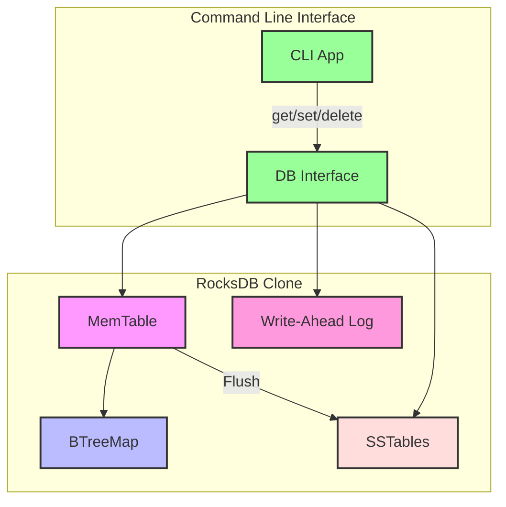

# RocksDB Clone

A learning-focused implementation of a RocksDB-like key-value store in Rust.

## Overview

This project is an educational implementation of a key-value store inspired by RocksDB. It's designed to help understand the internals of LSM-tree based storage engines.

## Features

- [x] In-memory MemTable with get/put/delete operations
- [x] Write-ahead log (WAL) for durability
- [x] SSTable storage format
- [ ] Compaction strategies
- [ ] MVCC (Multi-Version Concurrency Control)
- [ ] Column families
- [ ] Merge operators

## Current Architecture



### Components

- **CLI App**: Command-line interface for user interaction
- **DB Interface**: Main database API (get/put/delete)
- **MemTable**: In-memory key-value store with persistence
- **Write-Ahead Log (WAL)**: Ensures durability by logging all write operations
- **SSTables**: Immutable on-disk storage for key-value pairs, written when MemTable is full
- **BTreeMap**: Underlying data structure for the MemTable

> Note: The diagram shows the current implementation including SSTables. Future components (compaction, etc.) are not shown.

## Getting Started

### Prerequisites

- Rust (latest stable version recommended)
- Cargo (Rust's package manager)

### Building

```bash
# Build the project
cargo build

# Build in release mode
cargo build --release
```

### Running the CLI

The project includes a simple CLI for interacting with the persistent key-value store:

```bash
# Set a key-value pair (creates or updates the key)
cargo run -- set mykey "my value"

# Get a value by key
cargo run -- get mykey

# Delete a key (marks it as deleted with a tombstone)
cargo run -- delete mykey

# Specify a custom data directory (default is 'rocksdb_data')
cargo run -- --path ./mydata set mykey "my value"
```

### Persistence

The key-value store now includes persistence through a Write-Ahead Log (WAL). All write operations (put/delete) are first written to the WAL before being applied to the MemTable. On restart, the database recovers its state by replaying the WAL.

## Project Structure

- `src/config.rs`: Configuration management
- `src/error.rs`: Error types and handling
- `src/storage/`: Storage-related code
  - `mod.rs`: Storage module definition and Store trait
  - `memtable.rs`: In-memory key-value store with persistence
  - `wal.rs`: Write-Ahead Log implementation
  - `sstable.rs`: Sorted String Table implementation for persistent storage
- `src/bin/cli.rs`: Command-line interface
- `src/lib.rs`: Core database implementation

## Learning Resources

- [RocksDB Wiki](https://github.com/facebook/rocksdb/wiki)
- [LSM-Tree Paper](https://www.cs.umb.edu/~poneil/lsmtree.pdf)
- [Write-Ahead Logging](https://en.wikipedia.org/wiki/Write-ahead_logging)
- [Designing Data-Intensive Applications - Chapter 3](https://dataintensive.net/)
