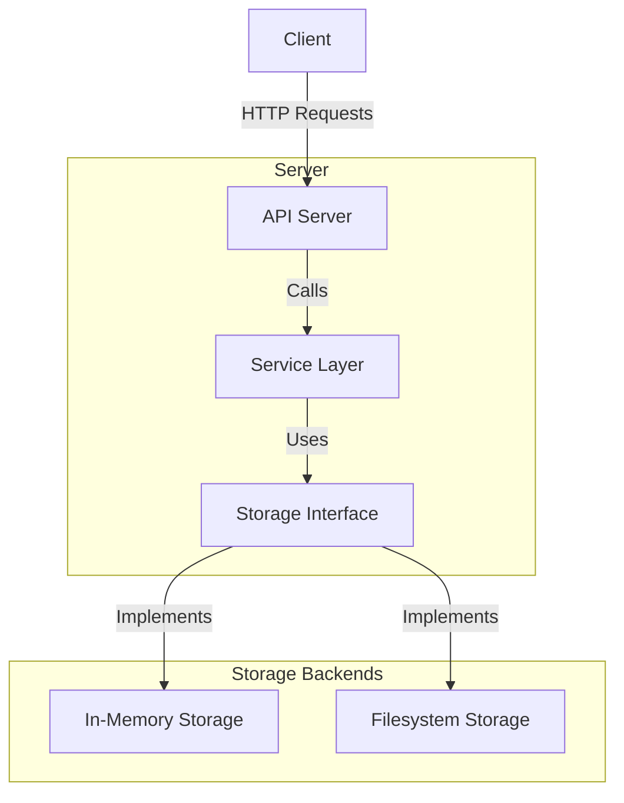

# S3 Clone Architecture

## High-Level Architecture



## Component Details

### 1. API Server

- Handles HTTP requests and responses
- Routes requests to appropriate handlers
- Validates input parameters
- Implements RESTful endpoints

### 2. Service Layer

- Contains business logic
- Manages transactions
- Handles error cases
- Enforces business rules

### 3. Storage Interface

- Defines the contract for storage operations
- Enables pluggable storage backends
- Supports operations for buckets and objects

### 4. Storage Implementations

#### In-Memory Storage

- Stores data in memory
- Good for testing and development
- Data is lost on server restart

#### Filesystem Storage

- Persists data to disk
- Organizes data in a directory structure
- Suitable for production use

## Data Flow

1. **Create Bucket**

   ```mermaid
   sequenceDiagram
       Client->>+API: PUT /bucket
       API->>+Service: CreateBucket(bucket)
       Service->>+Storage: CreateBucket(bucket)
       Storage-->>-Service: OK
       Service-->>-API: OK
       API-->>-Client: 200 OK
   ```

2. **Upload Object**

   ```mermaid
   sequenceDiagram
       Client->>+API: PUT /bucket/object
       API->>+Service: PutObject(bucket, key, data)
       Service->>+Storage: PutObject(bucket, key, data)
       Storage-->>-Service: OK
       Service-->>-API: OK
       API-->>-Client: 200 OK
   ```

3. **List Objects**

   ```mermaid
   sequenceDiagram
       Client->>+API: GET /bucket/
       API->>+Service: ListObjects(bucket)
       Service->>+Storage: ListObjects(bucket)
       Storage-->>-Service: [objects]
       Service-->>-API: [objects]
       API-->>-Client: 200 OK
   ```

## Error Handling

- **400 Bad Request**: Invalid input parameters
- **404 Not Found**: Resource doesn't exist
- **409 Conflict**: Resource already exists
- **500 Internal Server Error**: Server-side error

## Security Considerations

- All operations are currently unauthenticated (for demo purposes)
- In a production environment, implement:
  - Authentication (e.g., AWS Signature V4)
  - Authorization (e.g., IAM policies)
  - HTTPS for secure communication
  - Input validation and sanitization

## Performance Considerations

- In-memory storage is fast but doesn't persist data
- Filesystem storage adds I/O overhead but provides persistence
- Consider adding caching for frequently accessed objects
- Implement connection pooling for database/storage access
