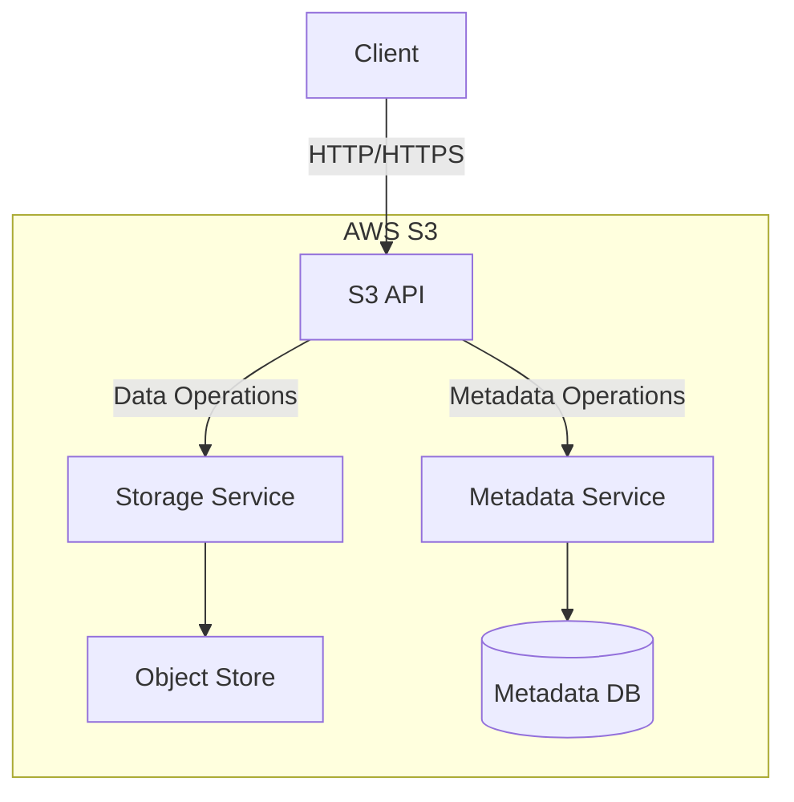
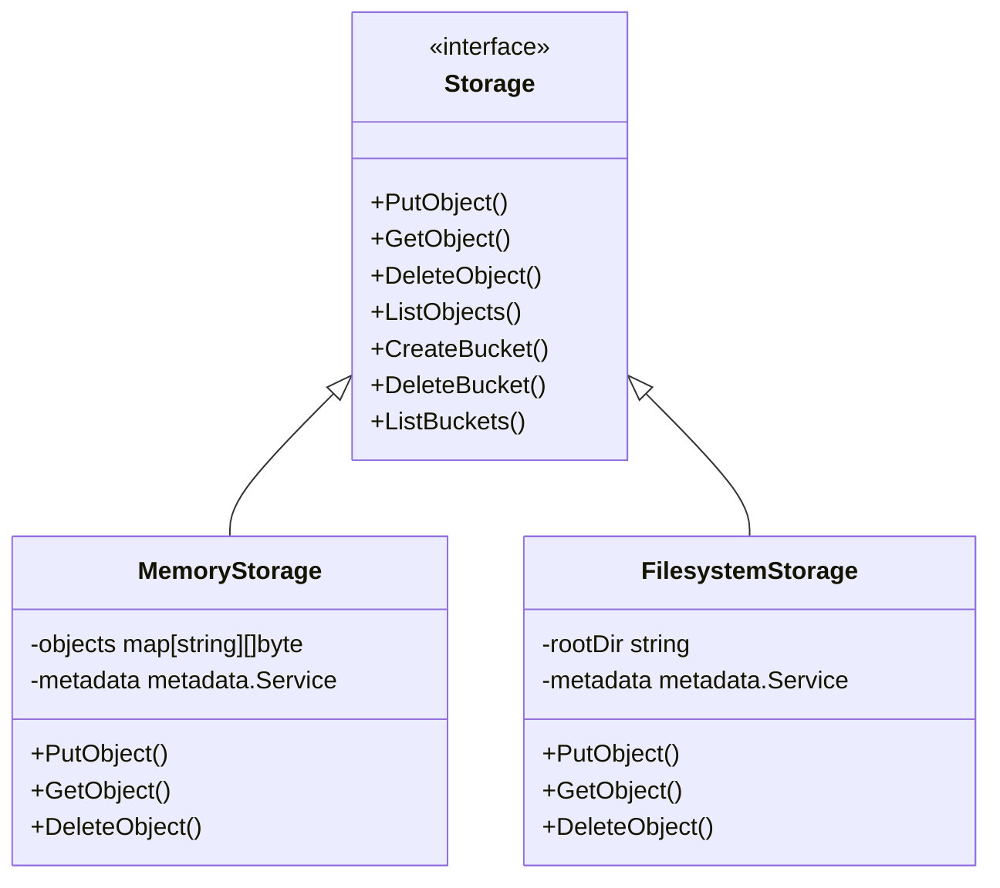

# Amazon S3 Deep Dive

This document summarizes the key architectural concepts and implementation details learned from building an S3 clone.

## Core Concepts

### 1. Architecture Overview

### 2. Key Components

#### a. API Layer

- RESTful HTTP/HTTPS interface
- Handles request authentication/authorization
- Validates and processes requests
- Routes to appropriate services

#### b. Metadata Service

- Tracks all bucket and object metadata
- Handles:
  - Bucket creation/deletion
  - Object metadata (size, timestamps, etc.)
  - Access control lists (ACLs)
  - Object versioning

#### c. Storage Service

- Manages object data storage
- Handles:
  - Data durability
  - Data distribution
  - Storage class management
  - Encryption

### 3. Data Model

#### Buckets

- Top-level containers for objects
- Globally unique names
- Region-specific
- Support versioning, logging, and website configuration

#### Objects

- Fundamental entities stored in S3
- Consist of:
  - Key (unique identifier within bucket)
  - Value (data)
  - Version ID (if versioning enabled)
  - Metadata (system and user-defined)

### 4. Consistency Model

- **Read-after-write consistency** for PUTS of new objects
- **Eventual consistency** for overwrite PUTS and DELETES
- Strong consistency for list operations (after March 2020)

## Implementation Insights

### 1. Storage Backends

Our implementation supports multiple backends:

### 2. Performance Considerations

#### a. Data Distribution

- Objects are distributed across multiple servers
- Partitioning by key prefix
- Consistent hashing for load balancing

#### b. Caching

- Edge caching (CloudFront)
- Client-side caching
- Metadata caching

### 3. Durability and Availability

| Feature | Implementation |
|---------|----------------|
| Data Replication | Multiple copies across availability zones |
| Checksums | MD5 for data integrity |
| Versioning | Optional object version history |
| Lifecycle Policies | Automated data management |

### 4. Security

- **Encryption**:
  - Server-Side Encryption (SSE)
  - Client-Side Encryption
  - KMS Integration
  
- **Access Control**:
  - IAM Policies
  - Bucket Policies
  - ACLs
  - Presigned URLs

## Lessons Learned

1. **Scalability**
   - Horizontal scaling is essential for storage services
   - Stateless design enables easy scaling of API layer
   - Metadata service is often the bottleneck

2. **Consistency vs. Performance**
   - Eventual consistency improves availability
   - Strong consistency impacts performance
   - Choose based on use case requirements

3. **Cost Optimization**
   - Storage classes (Standard, Intelligent-Tiering, Glacier)
   - Lifecycle policies for automated data management
   - Monitoring and analytics for optimization

4. **Operational Considerations**
   - Monitoring and alerting are crucial
   - Automated backups and disaster recovery
   - Capacity planning

## Comparison with Our Implementation

| Feature | AWS S3 | Our S3 Clone |
|---------|--------|--------------|
| Scalability | Virtually unlimited | Limited by server resources |
| Durability | 99.999999999% (11 9's) | Depends on storage backend |
| Availability | 99.99% | Single point of failure |
| Security | IAM, KMS, Encryption | Basic authentication only |
| Performance | Global CDN, Multi-AZ | Single server performance |
| Cost | Pay-as-you-go | Free and open source |

## Future Improvements

1. **Scalability**
   - Sharding for metadata
   - Distributed storage backends
   - Load balancing

2. **Features**
   - Multipart uploads
   - Object versioning
   - Server-side encryption
   - CORS configuration
   - Website hosting

3. **Operational**
   - Monitoring and metrics
   - Logging and auditing
   - Backup and recovery

## References

1. [Amazon S3 Developer Guide](https://docs.aws.amazon.com/AmazonS3/latest/dev/Welcome.html)
2. [S3 Consistency Model](https://aws.amazon.com/s3/consistency/)
3. [S3 Storage Classes](https://aws.amazon.com/s3/storage-classes/)
4. [S3 Security Best Practices](https://docs.aws.amazon.com/AmazonS3/latest/dev/security-best-practices.html)
